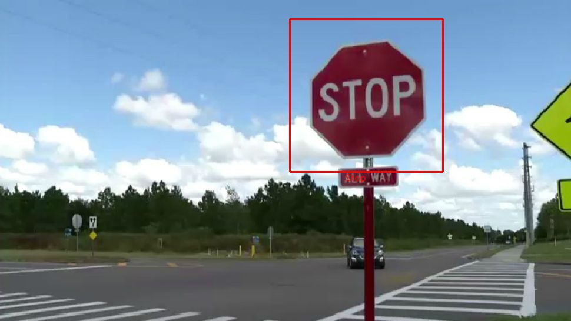
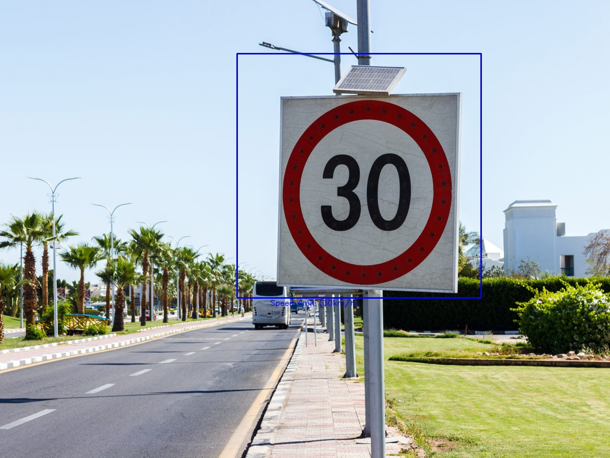
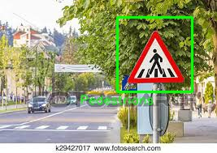

# Traffic Project
## Proyecto

En este proyecto se desarrolla la detección y clasificación de señales de tráfico.

Para ello se ha usado Opencv (Haar Cascade) para la detección de señales de tráfico y una red neuronal convolucional para su identificación.

## Contenido en las carpetas

En la carpeta data/traffic_cascades se encuentran los haar cascades.

En la carpeta model, los modelos entrenados para clasificar las señales.

Se han entrenado con el dataset https://www.kaggle.com/valentynsichkar/traffic-signs-preprocessed data8.pickle

## Descripción de la api

Endpoints:

<pre><code>/image/signs</code></pre>

Almacena una imagen con la carpeta static con las señales de la foto recuadradas

<ul>
    <li>Method: POST</li>
    <li>Param: image</li>
    <li>Return: ruta de la imagen con las detecciones</li>
</ul>
<pre><code>/upload/image</code></pre>

Sube una imagen a la carpeta static

<ul>
    <li>Method: POST</li>
    <li>Param: image</li>
    <li>Return: filename</li>
</ul>

## Resultados

Adjunto capturas de fotos de prueba

Stop

Limite velocidad

Precaución:

